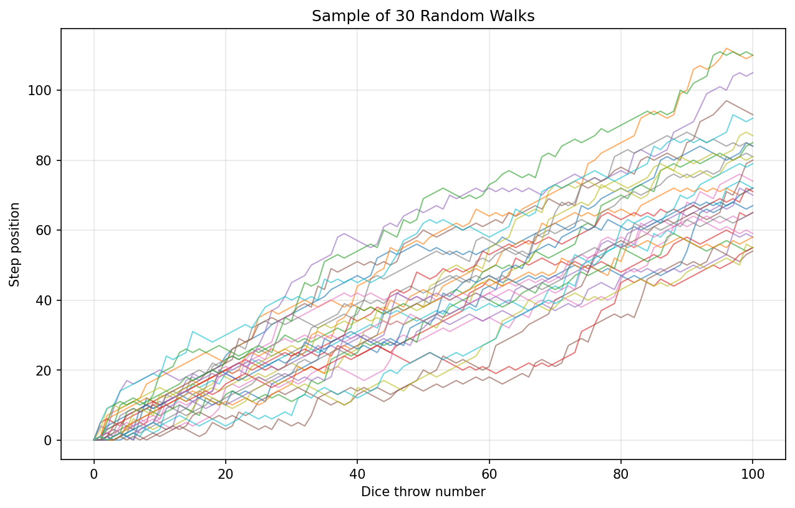
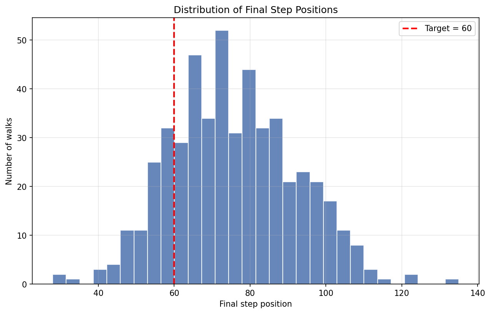

# Monte Carlo Simulation of Random Walk Outcomes

This started as a small "what are the odds?" puzzle and I built it out into a
proper little project.

The setup: you stand on step 0 of a staircase and roll a dice 100 times. Low
rolls push you down a step, middling rolls move you up one, and a six lets you
jump up by another dice roll. The question I wanted to answer sounds simple but
is annoying to solve on paper:

**What's the chance you end up on step 60 or higher after 100 throws?**

Rather than fight the maths, I let the computer play the game thousands of times
and just counted how often it reached 60. That's the whole idea behind Monte
Carlo simulation, and it's a surprisingly clean way to get an answer you can
trust.

Here's what 30 of those walks actually look like:



Most of them drift upward, but the spread is wide. That's exactly why one run
tells you almost nothing and you need a few thousand before the answer settles.

## The rules

- Roll a 1 or 2: move down one step (but you can't go below 0)
- Roll a 3, 4 or 5: move up one step
- Roll a 6: move up by a random amount between 1 and 6

I also added an optional "fall risk" on top of that: a tiny chance on each throw
that you slip all the way back to step 0. It's off by default, but you can turn
it on in the dashboard and watch the odds collapse. In my runs, switching on a 1%
fall chance dropped the success rate from about 84% to roughly 40%, which makes
sense once you realise a single slip wipes out everything.

## Running it

```bash
python -m venv .venv

# Windows PowerShell
.venv\Scripts\Activate.ps1
# macOS / Linux
source .venv/bin/activate

pip install -r requirements.txt
streamlit run app.py
```

That opens the dashboard in your browser. You can drag sliders for the number of
walks, the number of throws, the target step, the seed, and the fall risk, and
everything updates live.

A couple of other things you can run:

```bash
pytest -q          # run the tests
jupyter notebook   # open notebooks/01_random_walk_analysis.ipynb
```

## How it's put together

I kept all the actual logic in `src/` and made the dashboard and the notebook
just call into it. Partly that made the tests easier to write, and partly I got
tired of pasting the same simulation code into three different places.

```
app.py                 the Streamlit dashboard (just the UI)
src/
  config.py            default settings in one spot
  simulation.py        the dice-rolling engine
  analysis.py          probability, summary stats, sensitivity
  visualization.py     the matplotlib and plotly charts
tests/                 pytest tests for the engine and the stats
notebooks/             a walkthrough notebook telling the whole story
outputs/               saved charts and CSVs
data/                  empty on purpose; there's no external dataset
```

## What the dashboard shows

- The headline probability of reaching the target, plus the average, median,
  spread, and the best and worst walks
- An interactive plot of sample walks so you can see the individual paths
- A histogram of where walks finish, with the target marked
- A sensitivity table and chart showing the estimate settle down as you run more
  simulations (this is the part that convinced me the number was real and not
  just luck)
- A short written summary and buttons to download the results as CSV

If you just want the punchline, here's where a default run of 500 walks ends up,
with the target line in red:



Most walks finish past 60, which is why the success probability comes out around
84%.

## A note on what this is

It's a mini-project, and I'm not pretending otherwise. There's no machine
learning here and it doesn't need any. It's me taking a textbook probability
exercise and turning it into something with reusable code, tests, charts and a
dashboard I can actually click around in. If you want to see how I write Python
and think about probability and simulation, this is a decent place to look.

## Stuff I might add later

Confidence intervals around the probability would be the obvious next step, and
it'd be nice to let people edit the dice rules from the dashboard instead of
hard-coding them. Maybe a way to compare two rule sets side by side. Haven't
gotten to any of it yet.
